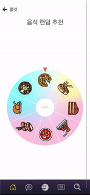
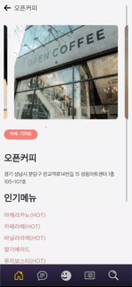

# BOBfull

## 익명 기반 식사 매칭 프로젝트

> [BackEnd-Repository](https://github.com/kmk4162/bobfull)

​    

---

## ❗[Refactoring Doc](./Refactoring.md)❗

- 개인학습을 위해 코드 리팩토링 진행
- 모든 부분을 진행하지는 않았음 
- 성능저하 해소, 레이어 분리, 리액트에서의 DOM조작 제거등을 진행함
- 지속적인 학습을 통해 더 개선할 예정

---

​     

## 🔖 Table of contents

- [BOBfull](#BOBfull)
  - [🔖 Table of contents](#-table-of-contents)
  - [📜 General info](#-general-info)
  - [🧭Preview](#Preview)
  - [🗃️Modeling](#️modeling)
    - [ERD모델](#erd-모델)
    - [와이어프레임](#와이어-프레임)
  - [💻Technologies](#technologies)
    - [Technology stack](#technology-stack)
  - [🔍Features](#features)
    - [Backend](#Backend)
      - [Accounts APP](#accounts-app)
      - [Articles APP](#articles-app)
      - [Community APP](#community-app)
      - [Multichat APP](#multichat-app)
      - [Restaurant APP](#restaurant-app)
    - [Frontend](#Frontend)
        - [React](#React)
        - [Redux](#Redux)
  - [💬Reviews](#reviews)
  - [Scrum Records](#scrum-records)

​    

## 📜 General info

- 개발기간 : 2022. 11. 23 - 2022. 12. 14

- 팀원
  
  - Front-end([신윤식](https://github.com/Yoonsik-Shin/), [이용환](https://github.com/tnpfldyd/))
  - Back-end([김문경](https://github.com/kmk4162/), [이주용](https://github.com/yaonggod/), [이태극](https://github.com/uRo3YA/))

​    

## 🧭Preview

- 메인 화면
	
	
- 프로필 페이지
  
  
  
- 룰렛
  
  
  
- 리뷰 작성
  
  

​    

## 🗃️Modeling

### ERD 모델

> .png)

​    

### 와이어 프레임

> 

​    

## 💻Technologies

### Technology stack

- Version Control and Messenger
  
    

  
  
- Backend 
  
   

  
  
- Frontend
  
     
* Infra
  
     
  
  
  
* CI/CD

  

​      

## 🔍Features

### Backend

#### Accounts APP

- 계정 생성 및 로그인
  - JWT인증 방식을 이용한 토큰 기반 로그인 구현
- 구글, 카카오 소셜 로그인

- 추가 설정을 통한 개인정보 수정 기능
-  유저의 활동 내역 조회

#### Articles APP

-  식당별 리뷰
    - 식당 PK을 기준으로 짧은 리뷰 생성
    - 별점 기능
-  매칭룸 생성 기능
    - 약속시간 생성
-  매칭룸 참가 기능
    - POST 요청으로 접속한 계정을 매칭룸 멤버에 추가
-  매칭 후기
    - 각 멤버 별로 매칭에 참가 한 이후 타인 유저를 평가
    - 평가 점수에 따라 해당 유저의 매너 온도 변화

#### Community APP

-  CRUD 통한 지역 기반 커뮤니티 기능
- 좋아요 기능을 통한 N:M 기능 구현

#### Multichat APP

- 유저가 참여하고 있는 채팅방 리스트 
- 매칭룸별 채팅방 생성
- 채팅방에 있는 모든 메세지 보기
- 채팅방에 메세지 전송하기
- 기존에 존재하는 채팅방에 참여하기
- 채팅방 나가기
- 식사 후 채팅방 없애기

#### Restaurant APP

- 카카오맵을 통한 음식점 데이터 크롤링(강남, 판교)
- 음식점 북마크 기능

### Frontend

#### React

- API 요청 및 화면구성
- Geolocation API를 통한 현재 위치와 음식점 간의 위치 계산
- React-query를 활용한 최신 DB내용 상태 관리
- PWA를 이용한 웹 앱 기능 활용

#### Redux

- JWT 토큰 로그인 후 유저의 상태관리

​    

## 💬Reviews

- 김문경
  
  - 백과 프론트를 분리해서 현업과 유사한 환경에서 3주라는 긴 시간동안 하나의 프로젝트를 끝내는데 성공했습니다. DRF와 React라는 신기술을 도전하면서 결과물을 만들어내느라 팀원 모두가 어려움을 겪고 개발 속도가 느렸던 점이 아쉬웠습니다. 팀원 모두가 너무나 실력있고 좋으신 분들이라 많이 배웠다고 생각합니다.
  - 한 조직의 리더 역할이 얼마나 어려운 것인지 다시 한 번 깨달았고, 팀원들 덕분에 무사히 최종 프로젝트를 끝냈다고 생각합니다.
  - 무엇보다 예비 백엔드 개발자로써 모델과 모델간의 관계, 함수의 동작 순서 등을 파악하는 능력을 기르는 것이 필수적이라고 느꼈습니다.
    
  
- 신윤식
  
  - 백엔드와 프론트엔드 모두 새로운 기술을 도입하여 학습을 통해 어느정도 괄목 할 만한 작업물을 만들어냄 기술적으로 부족한 부분이 많아 구현하고 싶은 것들이 많았지만 포기해야만 했음
  
  - 실력있는 팀원들과 함께 협업을 맞춘다는 것이 좋았고, 진하게 프론트엔드를 경험해볼 수 있어서 좋았습니다.

    
  
- 이용환
  
  - DRF와 React 에 도전해봐서 좋았고 시간이 지날수록 너무 빨리 끝난다라는 생각에 아쉬웠다. 시간이 더 있고 미리 알던 지식이었으면 더 정교하고 많은 기능을 추가할 수 있었겠지만, 새로운 지식이다보니 초반에 진행속도가 늦었던 점이 아쉬웠다.
  
  - 새로운 지식에 대해서 배울 수 있는 점이 너무 좋았고, 앞으로 어떻게 개인공부를 해야할지 약간의 방향성이 잡혀서 너무 좋았다.

    
  
- 이주용
  
  - 백과 프론트를 철저히 분리해서 한 프로젝트는 이번이 처음이었는데 새로운 기술을 익히면서 동시에 프로젝트를 수행하는 것은 생각했던 것보다 훨씬 어려웠습니다. 하지만 새로운 기술에 도전해보고 새로운 기능을 개발하는데 도전해봐서 좋았습니다. 이번 프로젝트를 계기로 시야가 넓은 개발자가 되어야 겠다고 생각했습니다. 
  
  - 내가 다른 사람이 하고 있는 부분에 대한 이해도가 어느 정도 있어야 프로젝트를 하면서 원활한 소통이 가능하고 더 좋은 결과물을 낼 수 있다는 것을 이번에 알게 되었기 때문입니다. 백엔드 개발자로 진로를 잡았지만, 프론트엔드 공부도 열심히 해야겠다고 느꼈습니다. 다들 수고하셨습니다.
  
  - 다들 판교에서 모여서 밥풀합시다
  
    
  
- 이태극
  
  - 3주라는 짧다면 짧고 길다면 긴 프로젝트를 끝마쳤습니다. 
  - 모든 팀원이 DRF, React라는 새로운 기술스택을 적용해보고, 개발하는 과정이 어려웠습니다.
     하지만, 여러문서를 참조하며 기능 개발을 하는 과정은 재미있었습니다.
  - 프론트와 백 서로 따로 배포를 하여 백서버와 프론트 서버를 연결시키는 것을 경험하여 좋았습니다.
  

​    

## Scrum Records

- [스크럼 일지](./scrum)
  
  
